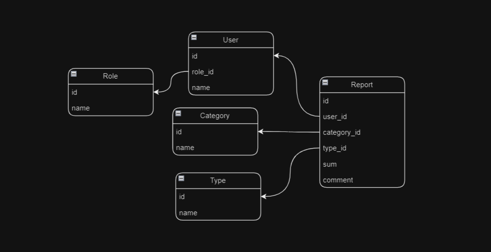

<p align="center"><a href="https://laravel.com" target="_blank"></a></p>


## About Project

Through this small project we can control the current income and expenditure in the family. Each family member has their own password to log in. And users have 3 roles. Users can control their daily and monthly expenses. \
 In addition, the mother has the right to control the finances of her children, and the father has the right to control the whole family.

\
Write the following code in the ``app\helpers.php`` to separate numbers with spaces

```
 function formatCurrency($number)
  {
      return number_format($number, 2, ',', ' ');
  }
```

It has already got fake data. Just run the code below 
```
$ php artisan migrate:fresh --seed
```


### Model's structures


